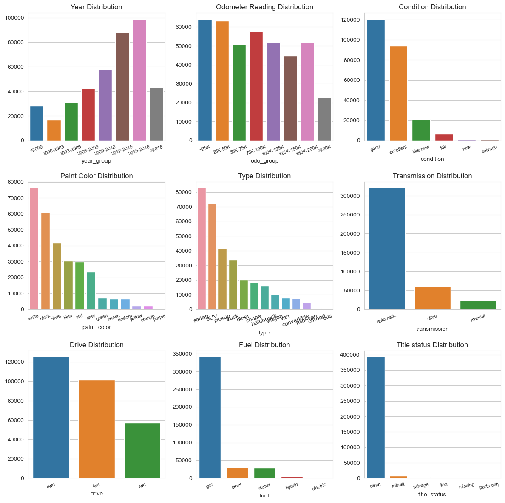
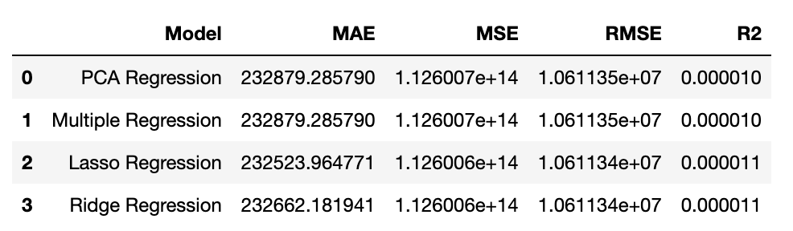

## What drives the price of a car?

As part of this exercise, I have examined the cars dataset, which has information on about 426K cars. Leveraging this data and by applying various machine learning regression models, I have explored the factors that make a car more or less expenive. I have provided a clear recommendation as to what a consumer value in a used car.

- Here is the [Data](https://github.com/csonamohan/sonawork/blob/main/data/coupons.csv)
- Here is the [Notebook](https://github.com/csonamohan/sonawork/blob/main/prompt.ipynb)

## Exploring the data

A detailed look at the data some interesting facts - 
* Most used cars are less than 10 years old (>2015)
* The largest number of vehicles are white automatic sedans
* There are very few diesel and electric cars in the used car dealerships
* California and Florida sell the most used cars
* Ford, Cheverlot and Toyota are the most popular manufacturers

## Cleaning up the Data

The data provided encompasses 14 attributes, providing valuable insights into user preferences while purchasing a car. I took the following steps to understand that data and prepare it for data modeling - 

- Identified features and target variables
- Removed unnecessary features
- Found the number of null values in the dataset and take necessary steps to eliminate those
- Found the datatype of the different series 
- Performed one-hot-encoding to convert categorical data into numeric data.
- Reduced the dimensions of the hot-encoded dataset with PCA for easier processing.

## Modeling

After making the necessary changes, I split the dataset into test and train sets. I then ran the different regression models - Multiple Regression, PCA regression, Lasso Regression and Ridge regression. I used the following evaluation metrics for comparing the models - MSE, MAE, RMSE and R2. Here is what I got - 

## Findings

From what is seen here, it is clear that - 
* Model and manufacturer are two most important dimensions that determine price. 
* Drive, Type, State, paint, fuel, title, transmission, condition, cylinders - these are the next set of important dimensions
* California, Arkansas, Colorado, Arizona and Alabama - these states have higher influence on price. Most probably, these states have certain special price rules/taxes.

## Next steps / Recommendations
- We need to continue to eliminate dimensions and see further patterns in car price data to know the full influence of various factors.
- We need to understand tax rules of states to understand why prices are influenced by states these cars are sold