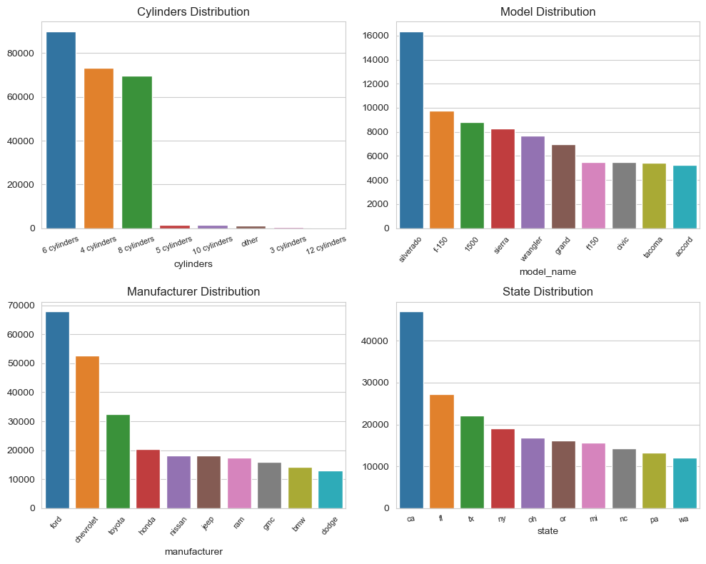

## What drives the price of a car?

As part of this exercise, I have examined the cars dataset, which has information on about 426K cars. Leveraging this data and by applying various machine learning regression models, I have explored the factors that make a car more or less expenive. I have provided a clear recommendation as to what a consumer value in a used car.

- Here is the [Data](https://github.com/csonamohan/carprice/blob/main/data/vehicles.csv)
- Here is the [Notebook](https://github.com/csonamohan/carprice/blob/main/prompt_II.ipynb)

## Exploring the data

A detailed look at the data some interesting facts - 
* Most used cars are less than 10 years old (>2015)
* The largest number of vehicles are white automatic sedans
* There are very few diesel and electric cars in the used car dealerships
* California and Florida sell the most used cars
* Ford, Cheverlot and Toyota are the most popular manufacturers

## Cleaning up the Data

The data provided encompasses 14 attributes, providing valuable insights into user preferences while purchasing a car. I took the following steps to understand that data and prepare it for data modeling - 

- Identified features and target variables
- Removed unnecessary features
- Found the number of null values in the dataset and take necessary steps to eliminate those
- Found the datatype of the different series 
- Performed one-hot-encoding to convert categorical data into numeric data.
- Reduced the dimensions of the hot-encoded dataset with PCA for easier processing.

## Modeling

After making the necessary changes, I split the dataset into test and train sets. I then ran the different regression models - Multiple Regression, PCA regression, Lasso Regression and Ridge regression. I used the following evaluation metrics for comparing the models - MSE, MAE, RMSE and R2. Here is what I got - 

1. If we want to prioritize minimizing large errors, we need to look at the model with the least MSE/RMSE. In this case, Ridge and Lasso model both have the least MSE/RMSE.
2. To determine the model with best overall accuracy, we need to look at the model with the least MAE. Here, Lasso model gives the best MAE.
3. R-squared metric provides a straightforward indication of how well the model fits the data. Higher the R2, the better fit. Here both Ridge and Lasso models seem to do the best.

## Findings

From what is seen here, it is clear that - 
* Model and manufacturer are two most important dimensions that determine price. 
* Drive, Type, State, paint, fuel, title, transmission, condition, cylinders - these are the next set of important dimensions
* California, Arkansas, Colorado, Arizona and Alabama - these states have higher influence on price. Most probably, these states have certain special price rules/taxes.

## Next steps / Recommendations

We would continue with fine tuning the study because both Lasso and Ridge models have similar metrics - 
    
1. Assess Additional Metrics: Check if there are any other evaluation metrics available or domain-specific metrics that could provide additional insights into model performance. 

2. Conduct Sensitivity Analysis: Perform sensitivity analysis by varying the input parameters or assumptions used in the models. This can help assess the robustness of the models and identify scenarios where one model may outperform the others.

3. Explore Ensemble Methods: Consider combining the models using ensemble methods such as averaging, stacking, or boosting. Ensemble methods can often improve predictive performance by leveraging the strengths of individual models.

4. Review Data Quality: Verify the quality of the data used for model training and evaluation. Inconsistent or noisy data may lead to similar performance across multiple models. 
 
5. Consult Domain Experts: Seek input from domain experts or stakeholders to understand the specific requirements and priorities of the problem. Their insights can help guide the decision-making process and identify relevant factors that may influence model selection.

6. Perform Cross-Validation: Use cross-validation techniques to validate model performance on multiple subsets of the data. This can help detect any variability in performance and provide more robust estimates of model accuracy.